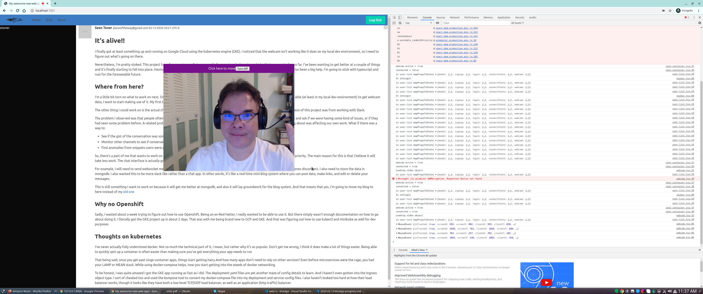

# Progress on khadga

Well, I was able to get a somewhat working version of khadga on Google Cloud Platform.  It's a
_long_ way from being done or even usable.  I still need to:

- Make warp use TLS
- Generate TLS cert from LetsEncrypt
- Create some ingress rules for load balancing on Google Kubernetes Engine
- Fix a problem with the webcam on GKE
- Send messages and events over the websocket
- Create JWT when logging in
- Do some form of 2FA for registration (even just send an email to user when registering)
- Do some form of 2FA for logging in (I might cheat and use OAuth)
- Figure out how GCP's dynamic DNS works
- Get a real domain name

And that's just to make it usable.

## What it looks like so far

I've got it to the point that there is a very simple mongodb backed database that will store your
registration details, a "Log In" modal that does a simple lookup if your passed in password matches
your username (usernames must be unique, and the registration handler will check for this.).  When
you log in, redux will store some state that you are logged in and on the backend.

If you click on the `Chat` link, it will create a mapping of username to websocket connection on the
backend.  The idea is that in the future as users connect, a message event will be sent to all other
connected users and the left most column in the webpage will be updated for users who connect and
disconnect all in (semi) real time.

Once you are logged in, you can go under More -> Webcam to turn on the webcam.  It will use the
webassembly library (noesis) to find the react ref for the \<video\> element and get the
MediaDevice.  The video element is wrapped in a moveable div element.

Here's what it looks like:



## Next steps

The screenshot you see above was actually generated from my local dev environment.  When I use the
image that I build and push to the Google Container Registry (GCR) it doesn't work, and I get an
error.  So I need to figure out what the mismatch is between my dev and production environment.
This begs for more testing which I've not done a lot of to be honest.

I'm just too eager to get to the meat of doing some deep learning that I want to skip all the
"frivolous" stuff :)  Yes, I know, I'm joking...sorta.  Testing feels like a burden initially, but
in the long run it pays off as you develop more and more code.  Rust and typescript are really good
about refactoring.  But sometimes changes are about more than types, and you need to make sure that
your interfaces between functions/modules are being obeyed correctly.  By interfaces, I don't mean
the types, but the logic behind what is going the interfaces.  This is why side effects are bad
because they are implicit in what's going on.

So I think these are going to my next immediate steps for things to work on

- Get warp to use TLS
  - Generate a TLS cert from LetsEncrypt
  - Setup the DNS records for khadga.app (ie, CNAME, A and AAAA records)
  - Figure out how GKE/GCP does dynamic DNS
- Improvements for the webcam
  - Fix the webcam issue on GKE
  - Tensorize the data coming from the webcam
- Start using khadga for my blogs
- Get the events over websocket so we can actually do chats
- Set up Travis for CI/CD

### Need TLS for khadga

I looked at how warp does TLS and it doesn't look that bad.  It's really just specifying where the
CA, public cert and pvt key are when instantiating the server.  So that's not the hard part I think.
The next step is to configure the google DNS server with my new domain `khadga.app`.  I still need
to look up how to configure the DNS records since I purchased it through domains.google.com.

This also means that I am going to need a real TLS cert.  Since I am cheap, I don't want to pay for
one (and they can get expensive), I need to figure out how to get LetsEncrypt certbot to give me a
certificate __and__ autorenew it since they are only valid for 90 days.  That also means I'm going
to need some way in the CI/CD pipeline to install the certs that warp will use and then also have
GKE redeploy.  Unless LetsEncrypt can automatically download the certs for my khadga backend
container?  Definitely something I need to check on how to do.

Also, I need to learn how GCP does dynamic DNS.  In AWS, they have a service called Route53 that
handles mapping a domain name to the dynamic external IP's that your EC2 or ECS instances will get.
In GCP, well, actually in kubernetes in general, when you start up a deployment, you have to expose
your deployment.  Each time you redeploy, you might get a new IP address.  For example, I can start
up all my configs for kubernetes with:'

```bash
gcloud auth login
cd /path/to/khadga/kubernetes
kubectl apply -k .
kubectl get service
```

The `kubectl get service` will return something like:

```bash
 stoner@stoner-desktop > kubectl get service                     
NAME         TYPE        CLUSTER-IP    EXTERNAL-IP   PORT(S)     AGE
khadga       ClusterIP   10.12.3.217   <none>        7001/TCP    14h
kubernetes   ClusterIP   10.12.0.1     <none>        443/TCP     42h
mongodb      ClusterIP   10.12.4.110   <none>        27017/TCP   14h
```

Notice there's no EXTERNAL-IP.  In order to get an external IP address, you can expose your
deployment.

```bash
kubectl expose deployment khadga --type=LoadBalancer --name=khadga-service
```

What that does is take the `khadga` deployment object type and expose it externally.  Notice I did
`expose deployment` and not `expose service`.  Once we run that command and give it a bit of time,
we should hopefully see something like this:

```bash
 stoner@stoner-desktop > kubectl get service
NAME             TYPE           CLUSTER-IP    EXTERNAL-IP    PORT(S)          AGE
khadga           ClusterIP      10.12.3.217   <none>         7001/TCP         14h
khadga-service   LoadBalancer   10.12.9.144   34.69.85.243   7001:32173/TCP   36s
kubernetes       ClusterIP      10.12.0.1     <none>         443/TCP          42h
mongodb          ClusterIP      10.12.4.110   <none>         27017/TCP        14h
```

Notice we have a new khadga-service with an external IP address, and it's bound (externally) to port
7001. The problem is that IP addresses as you redeploy or even reconfigure your different kubernetes
7002. types.  So we need a way to make sure that as the IP address changes, it still gets mapped to
`khadga.app`


### Improvements for the webcam

I'm not sure what's going on here.  There must be some mismatch between the docker image I am
building, and what gets run locally.  It's also not a GKE issue as I noticed it happens when I run
docker-compose as well.  My guess is something in my Dockerfile is not pointing to the right place,
or perhaps my version of noesis is old from npm and I'm somehow using a newer version (I vaguely
recall running `npm link` awhile back ago to test the noesis package locally).

I really want to start grabbing data from the webcam so I can start doing some classification tasks
using the image data.  On one hand, tensorflow has a method that will actually automatically
tensorize the data for you.  From my understanding of looking at the API so far, this only captures
a single frame at a time.

So to get video, you need to process in a while loop to get each image.  I don't know how fast this
is and it also means that all the data will be on the javascript side of the fence.  Well, that's
not true.  I could import the function to the rust side.  But there's a reason I kind of want to
avoid all that.

While webassembly invoking javascript functions has gotten dramatically faster (to the point that
[wasm invoking javascript is faster than JS to JS!][-speed]), there is still a problem with
transferring data.  Actually two:

- Need to [consider JS <-> copying of data][-conway]
- Memory for the tensors needs to be cleaned up manually

For the first point, this could actually be an argument for just using the built in `tf.data.webcam`
function.  However, the lack of control over the memory leads to two problems.  One of these
problems is mentioned in the 2nd bullet point.  In tensorflowjs, the underlying data is actually
going to be held in webgl textures (memory).  Since this memory is allocated outside of the JS
engine running in the browser, you have to remember to clean up after it.  While tensorflow comes
with a `tf.tidy` function to help with this, you have to remember to wrap any operation that creates
tensor data with tf.tidy.

If I did this in rust with webassembly, it will allow me to do two things:

- I can control how much data is obtained by the webcam by "drawing" it with the Canvas (or WebGL)
  API
- I can manually tensorize the data and the same memory allocation that applies to rust will be
  applied to webassembly, so no manual memory management will be needed

My ultimate goal is to actually port tensorflowjs to rust/webassembly, so I think this could be a
first baby-step to accomplishing that.

### Use khadga for my blogs

One of the problems with using github.io for my blogs is that no one can interact with them.  You
can't leave a comment or anything if you read my posts.  So I think I am going to have the app allow
registered users to create blog posts.  I'm still not sure how I want to display them though.  Like,
if there's a user "Bob", how do I show Bob's blog posts?

I think for now, it will just be me who can leave blog posts to simplify things.  It's not a core
purpose of the app afterall.  That being said, having blog posts and replies would still be useful
for NLP tasks.

Two other side benefits of getting blogs working:

- I can create more mongodb data for the blog posts
- More CSS front end layout work

Right now, I'm only using mongodb to store registration information so that when you log in, it can
look up your password (yeah I know, old-skool, but using OAuth services like Google or Facebook just
seems creepy to me from a privacy/DNT point of view).  I was thinking about storing all the chat
messages in the mongodb, though I'm still debating that one.  On one hand, I want to do end-to-end
encryption of all text data, but on the other hand, I need to create and train an NLP model and it
needs to look at historical data.  With the blog, there's no two ways about it; I have to store the
blogs in a database somewhere.

I also want to get better at CSS, especially grids and flexbox.  This will be an opportunity to do
things like Tiles or Cards and lay them out in a particular (hopefully pleasing) layout.

### Work with events over websocket

Right now, although the front end will open up a websocket connection once the user logs in and
clicks on the More -> Chat link, nothing is really happening.  For example, as users come and go in
the system, none of the information is being sent back to the webpage.

Public messages need to be "broadcast" to multiple connected users which will be handled as async
handlers that send the messages back over the websocket and then change the state on the react
components.

An alternative that I have been considering is to only allow peer-to-peer connections.  In that
case, khadga only acts as a rendezvous point for peers to find each other.  But in that case,
instead of khadga being the relay of messages, I'd have to build a messaging system in the front end
application, which will probably be more complicated.  The disadvantage of doing this is there is no
more central place to store data. 

### Set up Travis for CI/CD

I haven't worked with Travis before, but it seems pretty cool.  The thing I like about it is that
it's free for open source projects.  I'm fairly familiar with using Jenkins for CI/CD, but I've
always thought that was a bit of a hack.  Jenkins to me has always been a glorified cron job, and
indeed, that's originally what it was for.

Jenkins started getting complicated when they added Pipelines, but the problem with that is that you
still can't build arbitrary graphs of your build process.  It's basically a simple one way stage.  I
dont know enough about Travis to know what limitations it has, but at least it's free.

[-conway]: https://rustwasm.github.io/book/game-of-life/implementing.html#interfacing-rust-and-javascript
[-speed]: https://hacks.mozilla.org/2018/10/calls-between-javascript-and-webassembly-are-finally-fast-%f0%9f%8e%89/